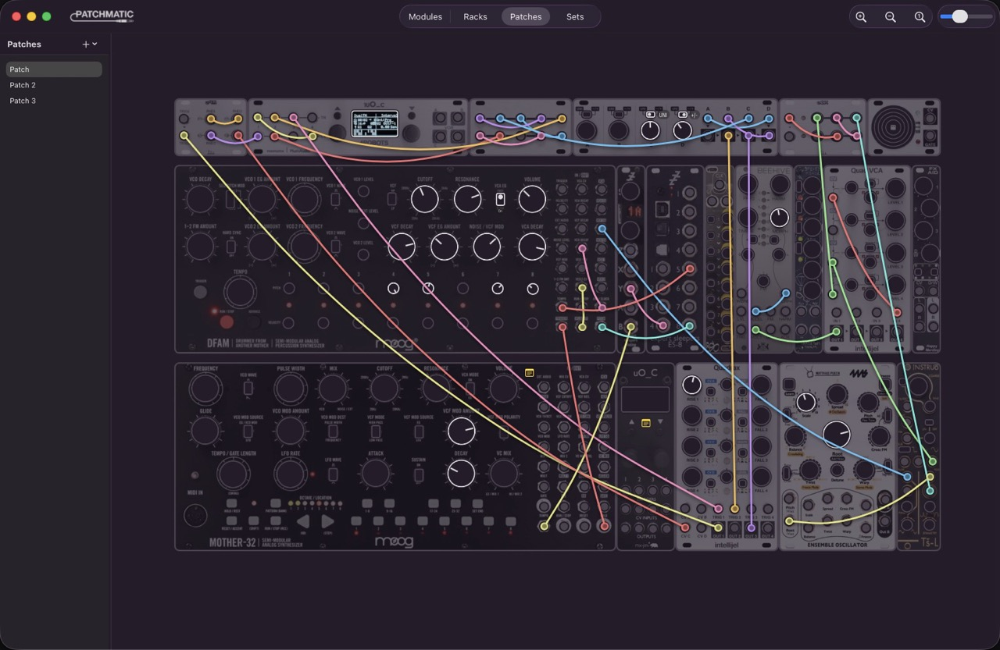
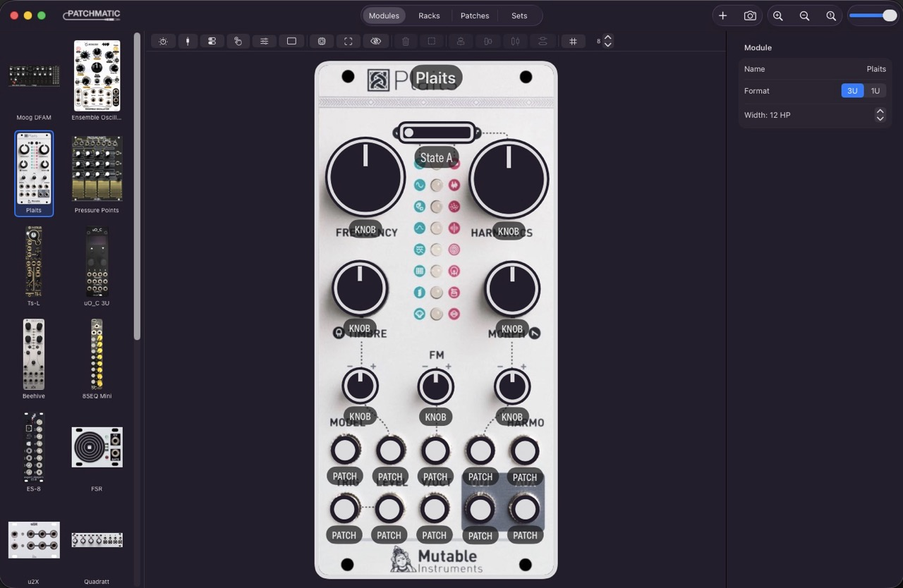
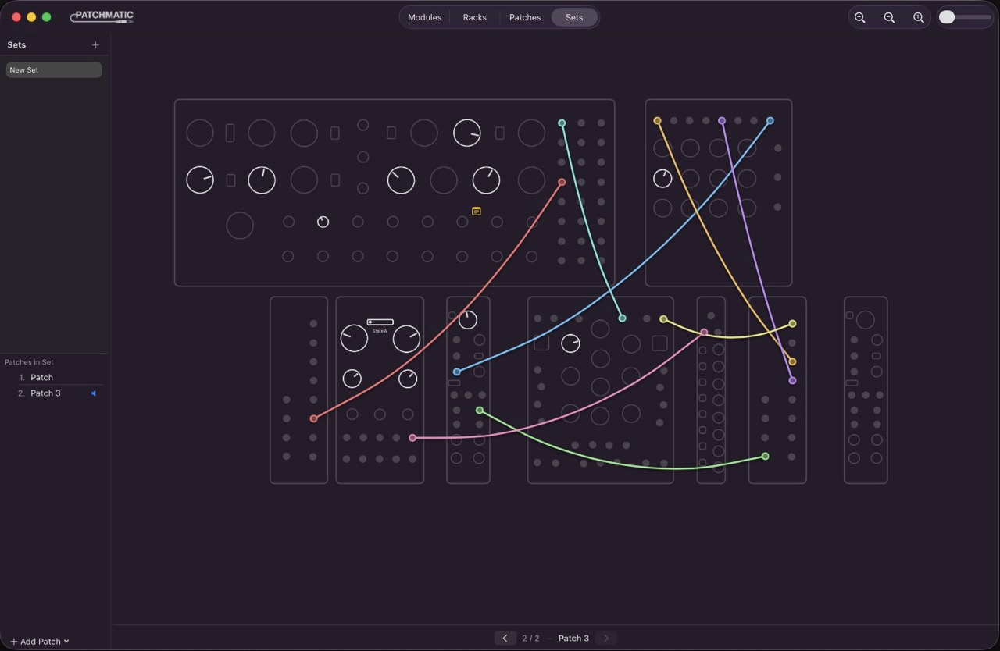

  

<h1 align="center">Patchmatic</h1>

A tool for logging eurorack patches.

---

## Overview

Patchmatic is MacOS application for recording your Eurorack patches, a bit like a mix of Modulargrid and VCV Rack without the audio. The name comes from 'Patch Schematic' and the original idea was for a tool that let you create easy to read schematics of patches, to enable efficient repatching.

## Features

**Module design**
- Place knobs, patch points, buttons, toggle switches, sliders, and screens on a panel
- Adjustable control size, orientation, and label positioning
- Import a panel photo — controls are detected automatically

**Rack assembly**
- Arrange modules in cases with 1U and 3U rows at any HP width
- Stack multiple cases in a single rack

**Patching**
- Draw cables between any two patch points, across cases
- Color-coded cables with physics-based patching
- Multiple patches per rack; organize into named sets

---

## Screenshots

---

## Requirements

- macOS 14.0 (Sonoma) or later
- Apple Silicon or Intel

---

## Installation

1. Download `Patchmatic-<version>.dmg` from the [Releases](../../releases) page
2. Open the DMG and drag Patchmatic to Applications
3. First launch: right-click the app → **Open** (the app is not notarized)

---

## Getting Started

1. **Create a module** — add controls manually or import a panel photo for automatic detection
2. **Build a rack** — create a case, add rows, place modules at HP positions
3. **Patch** — switch to Patches mode, drag cables between patch points
4. **Save presets** — each patch stores cable layout and all control positions independently
